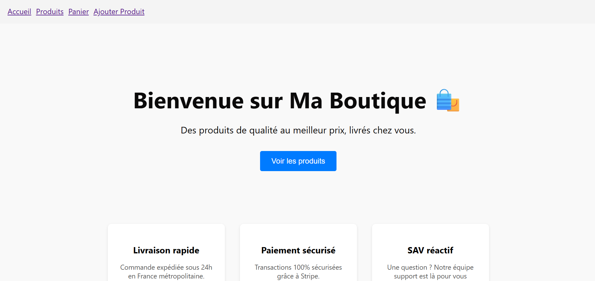
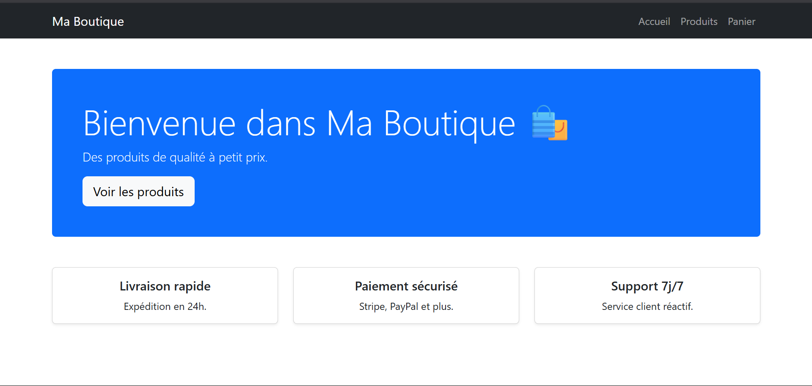

app ecommerce simple
c'est un projet propre 
Une application web de e-commerce avec panier, authentification et interface d’administration, construite avec React, Node.js, Express et MongoDB.

1 - page react (v1)

2- v2 avec bootsrap

